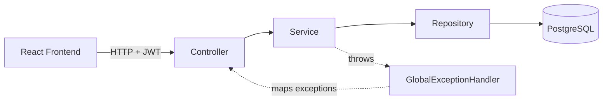
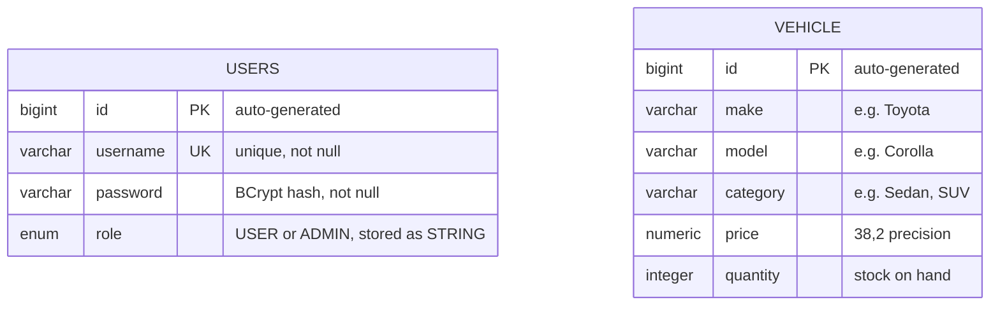
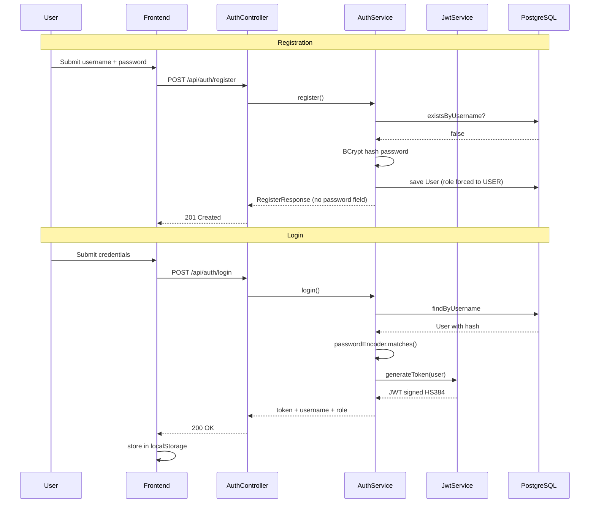
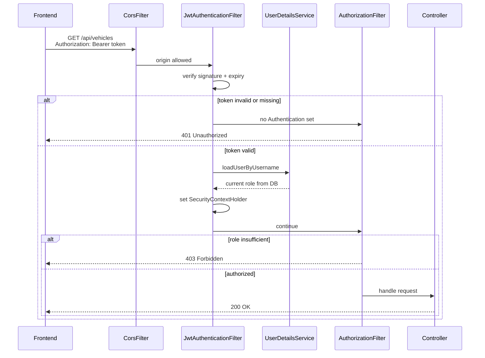
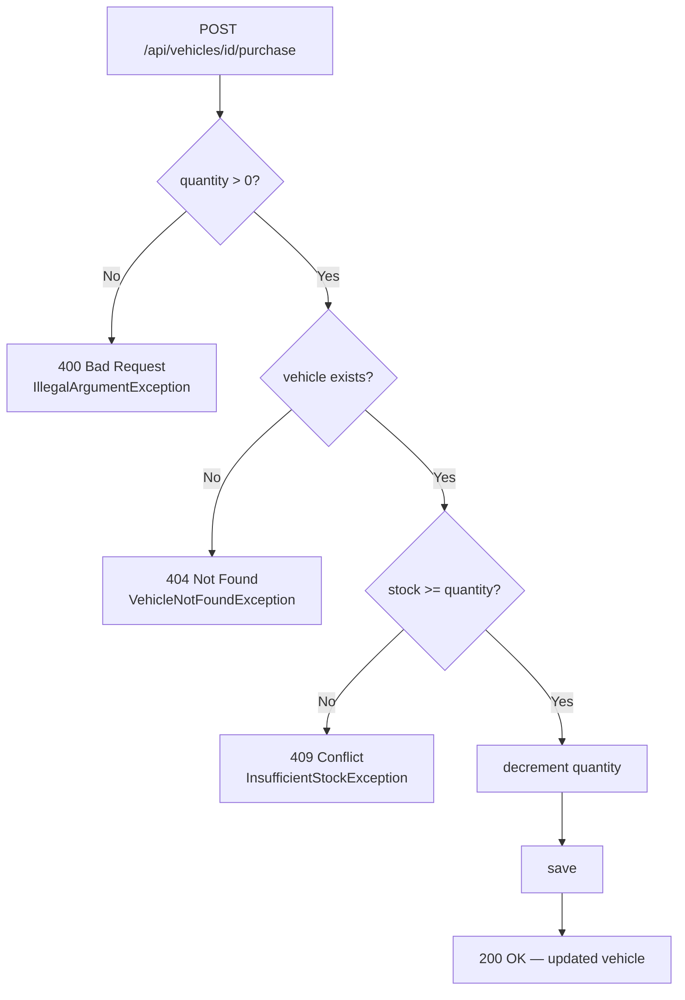

# 🚗 Car Dealership Inventory System

A full-stack inventory management system for a car dealership, built as a TDD kata.
Spring Boot REST API with JWT authentication and role-based access control, backed by
PostgreSQL, with a React frontend.

---

## 📋 Table of Contents

- [Features](#-features)
- [Tech Stack](#-tech-stack)
- [Architecture](#-architecture)
- [Database ER Diagram](#-database-er-diagram)
- [Authentication Flow](#-authentication-flow)
- [Purchase Flow](#-purchase-flow)
- [Setup](#-setup)
- [Configuration](#-configuration)
- [API Reference](#-api-reference)
- [Screenshots](#-screenshots)
- [Test Report](#-test-report)
- [Notable Bugs Found & Fixed](#-notable-bugs-found--fixed)
- [Known Limitations](#-known-limitations)
- [Security Notes](#-security-notes)
- [My AI Usage](#-my-ai-usage)

---

## ✨ Features

### Authentication & Authorization
- Registration and login with JWT (HS384, 1-hour expiry)
- BCrypt password hashing
- Role-based access control — `USER` / `ADMIN`
- Admin-only operations: delete vehicle, restock inventory

### Vehicle Management
- Create, list, update, delete vehicles
- Case-insensitive search across make, model, category, and price range — all filters optional and combinable
- Purchase — decrements stock, defaults to quantity 1
- Restock — increments stock, admin-only, explicit quantity required

### Frontend
- Login and registration forms with inline validation
- Dashboard listing all vehicles with live stock counts
- Search and filter panel
- Purchase button, disabled at zero stock with an "Out of Stock" badge
- Admin-only UI for add / edit / delete / restock
- Responsive layout, toast notifications

---

## 🛠 Tech Stack

| Layer | Technology |
|---|---|
| **Backend** | Java 21, Spring Boot 3.5.16, Spring Security, Spring Data JPA |
| **Database** | PostgreSQL 16 (runtime), H2 (tests) |
| **Auth** | JWT via jjwt 0.12.6, BCrypt |
| **Testing** | JUnit 5, Mockito, MockMvc, JaCoCo |
| **Frontend** | React, TypeScript, TanStack Start, Tailwind CSS |
| **Build** | Maven (wrapper), npm |

---

## 🏗 Architecture

```
car-dealership-kata/
├── backend/                    Spring Boot API
│   ├── src/main/java/com/pranshu/car_dealership/
│   │   ├── auth/               User, Role, AuthService, JwtService, filter, DTOs
│   │   ├── vehicle/            Vehicle, repository, service, controller, exceptions
│   │   ├── config/             SecurityConfig, AdminSeeder
│   │   └── web/                GlobalExceptionHandler, ApiError
│   ├── src/test/               Test suite
│   └── pom.xml
├── frontend/                   React application
│   ├── src/lib/api.ts          Single fetch wrapper — all API calls
│   ├── src/contexts/           Auth context
│   ├── src/components/         Dashboard, VehicleCard, forms
│   └── package.json
├── screenshots/
├── README.md
├── PROMPTS.md                  Full AI chat history
└── CLAUDE.md                   Instructions given to the AI pairing tool
```

**Package-by-feature, not package-by-layer.** Everything relating to vehicles lives in
`vehicle/`; everything relating to auth lives in `auth/`. Understanding or changing one
feature means looking in one folder, not four.

**Layered within each feature:** Controller → Service → Repository. Controllers handle
HTTP only, services hold business rules, repositories handle persistence.



---

## 🗄 Database ER Diagram



**On the absence of a relationship:** `USERS` and `VEHICLE` are intentionally independent.
The inventory is shared — any authenticated user acts on the same vehicle records, and
authorization is enforced by role rather than by ownership. There is no purchase-history
or ownership table, because the specification defines purchase as a stock decrement rather
than a recorded transaction. Adding an `ORDER` table linking the two would be the natural
first extension.

**Two schema decisions worth noting:**
- The table is named `users`, not `user` — `USER` is a reserved word in PostgreSQL and
  DDL generation fails without an explicit `@Table(name = "users")`.
- `role` uses `@Enumerated(EnumType.STRING)`, not `ORDINAL`. Ordinal stores 0/1, so
  reordering the enum would silently reassign every user's role in the database.

---

## 🔐 Authentication Flow



### Every request after login



**Why the database lookup on every request:** the role comes from the database, not from
the token's claim. A user who is deleted or demoted from ADMIN loses access immediately
rather than at token expiry. The cost is one indexed query per request.

**Why 401 and 403 are distinct:** 401 means *"I don't know who you are"* — the frontend
redirects to login. 403 means *"I know who you are and you may not do this"* — the
frontend shows a permission message without logging the user out.

---

## 🛒 Purchase Flow



Validation runs **before** any database access, and the stock check runs **before** the
quantity is mutated — so a failed purchase leaves no partial state, even accounting for
JPA dirty checking. Both orderings are pinned by tests.

---

## 🚀 Setup

### Prerequisites
- Java 21+
- Node.js 20+
- Docker

### 1. Start PostgreSQL

```bash
docker run --name cardealership-db \
  -e POSTGRES_PASSWORD=postgres \
  -e POSTGRES_DB=cardealership \
  -p 5432:5432 -d postgres:16-alpine
```

### 2. Start the backend

```bash
cd backend
./mvnw spring-boot:run          # Windows: .\mvnw.cmd spring-boot:run
```

Runs on `http://localhost:8080`. Hibernate creates the schema on startup and an admin
account is seeded if none exists.

**Default admin:** `admin` / `admin123` — development only, override with `ADMIN_PASSWORD`.

### 3. Start the frontend

```bash
cd frontend
npm install
npm run dev
```

Runs on `http://localhost:8081`.

Create `frontend/.env` (template in `.env.example`):

```
VITE_API_BASE_URL=http://localhost:8080
```

---

## ⚙️ Configuration

All configuration reads from environment variables with development defaults in
`application.yaml`. Production values are supplied via the environment and never committed.

| Variable | Purpose | Development default |
|---|---|---|
| `DB_URL` | PostgreSQL JDBC URL | `jdbc:postgresql://localhost:5432/cardealership` |
| `DB_USERNAME` | Database user | `postgres` |
| `DB_PASSWORD` | Database password | `postgres` |
| `JWT_SECRET` | JWT signing key — 32+ characters required | labelled dev-only value |
| `ADMIN_PASSWORD` | Seeded admin password | `admin123` |
| `VITE_API_BASE_URL` | Backend URL for the frontend | `http://localhost:8080` |

The committed defaults exist so the project runs with zero setup locally. A real
deployment must set `JWT_SECRET` and `ADMIN_PASSWORD` in the environment.

---

## 📡 API Reference

| Method | Endpoint | Auth | Description |
|---|---|---|---|
| `POST` | `/api/auth/register` | Public | Register — always creates a `USER` |
| `POST` | `/api/auth/login` | Public | Returns JWT, username, role |
| `GET` | `/api/vehicles` | Authenticated | List all vehicles |
| `GET` | `/api/vehicles/search` | Authenticated | Filter by `make`, `model`, `category`, `minPrice`, `maxPrice` |
| `POST` | `/api/vehicles` | Authenticated | Create a vehicle |
| `PUT` | `/api/vehicles/{id}` | Authenticated | Update a vehicle |
| `DELETE` | `/api/vehicles/{id}` | **ADMIN** | Delete a vehicle |
| `POST` | `/api/vehicles/{id}/purchase?quantity=` | Authenticated | Purchase — quantity defaults to 1 |
| `POST` | `/api/vehicles/{id}/restock?quantity=` | **ADMIN** | Restock — quantity required |

**Error responses** return `{"message": "..."}`:

| Status | Meaning |
|---|---|
| `400` | Invalid input — blank field, non-positive quantity |
| `401` | Not authenticated — missing, invalid, or expired token |
| `403` | Authenticated but not permitted |
| `404` | Vehicle not found |
| `409` | Conflict — insufficient stock, or username already taken |

---

## 📸 Screenshots

<!-- SCREENSHOT 1: the login page -->
### Login


<!-- SCREENSHOT 2: dashboard logged in as admin, showing Add Vehicle + Edit/Delete/Restock on cards -->
### Dashboard — Admin view


<!-- SCREENSHOT 3: dashboard logged in as a regular USER — no admin controls visible -->
### Dashboard — User view


<!-- SCREENSHOT 4: search panel with filters filled in and results showing -->
### Search & Filter


<!-- SCREENSHOT 5: the Add/Edit vehicle modal open -->
### Add / Edit Vehicle


---

## 🧪 Test Report

```bash
cd backend
./mvnw clean test
```

Report generated at `backend/target/site/jacoco/index.html`.

**53 tests, 0 failures.**

| Metric | Coverage |
|---|---|
| Instruction | **91%** |
| Branch | **75%** |

| Package | Instruction coverage |
|---|---|
| `web` | 100% |
| `auth` | 98% |
| `vehicle` | 96% |
| `config` | 69% |
| application entry point | 37% |

<!-- SCREENSHOT 6: the JaCoCo HTML report table -->


`config` and the application entry point show lower coverage because they consist of bean
wiring and the `main` method — code with no meaningful branches to test.

### Testing strategy

| Layer | Approach | Why |
|---|---|---|
| **Service** | Mockito, no Spring context | Fast; a failure points squarely at business logic |
| **Controller** | `@WebMvcTest` + mocked service, `addFilters = false` | Verifies the HTTP contract and exception-to-status mapping only — the rules are already proven at the service layer |
| **Repository** | `@DataJpaTest` against H2 | Search filtering lives in the query; a mocked repository cannot prove it works |
| **Security** | `@SpringBootTest`, filters enabled | The only place the filter chain and `@PreAuthorize` actually execute |
| **Error dispatch** | `RANDOM_PORT` + `TestRestTemplate` | MockMvc does not perform the servlet ERROR dispatch — see bug #1 below |

**Tests deliberately not written.** `findAll()` is a pass-through to the repository. A test
asserting that a mock returns what it was told to return proves nothing and inflates the
count. Tests were written where behaviour could actually be wrong.

---

## 🐛 Notable Bugs Found & Fixed

Three bugs surfaced only against the real running stack — all three passed a green test
suite. Each was reproduced against the live environment before any fix was written.

### 1. `401` returned instead of `403` for a forbidden request

The authorization filter correctly denied with 403 and called `sendError`, but Tomcat
re-dispatched internally to `/error`. The security chain ran a second time, and
`OncePerRequestFilter.shouldNotFilterErrorDispatch` defaults to `true` — so the JWT filter
was skipped on that pass, the context was anonymous, and the entry point rewrote the status
to 401.

**MockMvc does not perform ERROR dispatch**, so the existing integration suite was
structurally blind to it. Fixed by permitting `/error` in the filter chain, with a
`RANDOM_PORT` regression test verified to fail without the fix.

### 2. Search returned `500` on PostgreSQL — parse-time

Blank filters bind as untyped nulls. PostgreSQL resolves parameter types at parse time and
cannot infer a type from a bare `:param IS NULL`, so the statement failed to prepare
entirely. H2 tolerates untyped nulls, which is why the repository tests passed.

Fixed with an explicit `CAST` on every parameter.

### 3. Search returned `500` on PostgreSQL — execution-time

The `CAST` fix resolved parse-time inference but left a `bytea → numeric` cast, which
PostgreSQL forbids. A null parameter arrives as unspecified binary that the server treats
as `bytea`; `bytea → varchar` is legal but `bytea → numeric` is not — which is why only
the numeric filters failed while the string filters worked.

Fixed by routing numeric parameters through text first:
`CAST(CAST(:minPrice AS String) AS BigDecimal)`.

---

## ⚠️ Known Limitations

- **Repository tests run against H2, not PostgreSQL.** Bugs #2 and #3 are PostgreSQL-specific
  and structurally cannot be caught by an H2 test. A Testcontainers-backed PostgreSQL test
  would close this gap and is the natural next step.
- **No concurrency control on purchase.** `@Transactional` covers the read-modify-write within
  a single request, but two simultaneous purchases of the last unit could both succeed.
  Correct handling needs row-level locking, which is out of scope here.
- **Frontend has no automated tests.** A deliberate tradeoff under the deadline; the UI was
  verified manually against the running backend.
- **Case-insensitive search is not index-friendly.** `LOWER()` on the column prevents use of a
  plain index. At scale this needs a function-based expression index or a normalized column.
- **`ddl-auto: update`** manages the schema. Fine for a kata; production would use Flyway or
  Liquibase migrations, which handle renames and destructive changes safely.
- **`403` responses carry no message body.** Spring Security's access-denied response bypasses
  `GlobalExceptionHandler` via the error dispatch, so the frontend shows a generic permission
  message rather than a tailored one.
- **No request DTO for vehicles.** A client can send an `id` in the body; the service defends
  against it by always trusting the path id, pinned by a test. A request DTO without an `id`
  field would make the risk structurally impossible and is the cleaner fix.

---

## 🔒 Security Notes

- **Registration always assigns `USER`** — the role is never read from client input. Accepting
  it would let anyone self-register as an admin and defeat RBAC entirely. Admin accounts are
  created out-of-band by the startup seeder.
- **Passwords are BCrypt-hashed and never returned.** Register and login responses use DTOs, so
  the hash cannot be serialized to a client.
- **Login failures are indistinguishable.** An unknown username and a wrong password throw the
  same exception with the same message, preventing username enumeration.
- **JWT signature verification is the real control.** Claims are base64 and readable by anyone —
  only the signature stops a forged admin token. Covered by a test that signs a token with a
  different key and asserts rejection.
- **Per-request user lookup** means a deleted or demoted user loses access immediately rather
  than at token expiry.
- **CSRF is disabled, correctly.** The API is stateless and the token travels in an
  `Authorization` header, not a cookie — there is no ambient credential for a cross-site
  request to exploit.
- **Defence in depth on admin operations** — URL rules in the filter chain *plus* `@PreAuthorize`
  on the service methods, so the rule survives a new caller reaching the same service by a
  different route.
- **The committed JWT secret is a labelled development default.** Production reads `JWT_SECRET`
  from the environment.

---

## 🤖 My AI Usage

I used four AI tools on this project, in distinct roles.

### Which tools, and for what

| Tool | Role |
|---|---|
| **Claude (claude.ai)** | Planning and reasoning partner — setup decisions, understanding TDD as a practice, pressure-testing designs before implementing them |
| **Claude Code** | Main implementation tool, working in-repo under a committed `CLAUDE.md` |
| **Lovable** | Generated the initial React frontend from a written API specification |
| **Antigravity** | A later pass on UI design and component layout |

### How I used them

**Claude** was deliberately used as a place to *understand* rather than to generate. Most
exchanges were me explaining a concept back and being corrected — why a service test comes
before a controller test, what `@WebMvcTest` actually loads, why `thenAnswer` catches a bug
that `thenReturn` hides.

**Claude Code** worked under a committed `CLAUDE.md` setting the discipline: one feature at a
time, test first, minimal implementation, review every diff, explain the change back before
advancing. It wrote most of the test files and a significant share of the production code. I
wrote the `Vehicle` entity, the repository, the first `VehicleService`, and several smaller
fixes by hand.

**Lovable** generated the frontend from a specification I wrote containing the exact API
contract — endpoints, request and response shapes, status codes — verified against the running
backend beforehand rather than guessed. I reviewed the generated code before committing it.

**Antigravity** was used for a later visual pass on the interface.

Every AI-assisted commit carries a `Co-authored-by` trailer, and each commit body states what
the AI generated versus what I decided. The full prompt history is in
[PROMPTS.md](PROMPTS.md).

### Reflection

The most useful discipline was refusing to let the AI move faster than my understanding. The
`CLAUDE.md` rule that mattered most was the explain-back gate — after each feature I had to
restate what it did and why with the file closed. More than once that revealed I had accepted
something I could not actually justify, and we went back.

**I reversed AI suggestions where I disagreed.** When it proposed removing the public `setId`
from the entity and using reflection in the test instead, I reverted it. The design was
objectively cleaner, but the pattern was unfamiliar — and unfamiliar code is a liability in a
live pairing session where I might be asked to modify it on the spot. That was a deliberate
trade of elegance for the ability to work confidently in my own codebase.

**Where AI was least reliable was anything that only manifests at runtime.** All three bugs
above passed a fully green test suite. The pattern that worked was refusing to let the tool
guess: every fix started by reproducing the failure against the live database or the running
server, and twice the first hypothesis was wrong and the reproduction corrected it. The tool
was far better at *investigating* a real error than at *predicting* one — which is roughly
how I'd describe the boundary of what to trust it with.
```
